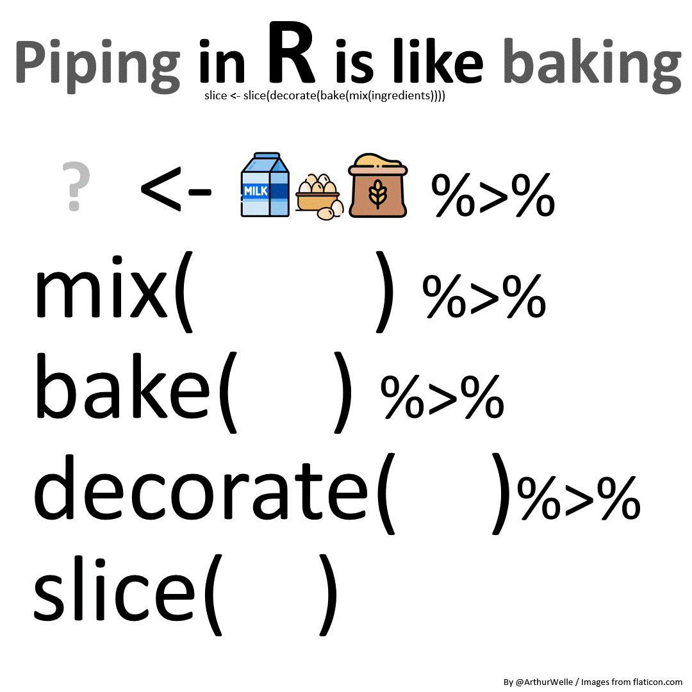

## Introduction

In this first unit we will get to grips with the basics of describing categorical data using RStudio. To follow this guide you should have first watched the video lectures on the VLE where each of the techniques here used are discussed in detail. Also on the VLE, you will find RStudio video tutorials that elaborate on this workshop guide.

The dataset we will analyse the **2012 UK Omnibus Poverty and Social Exclusion Survey: Necessities of Life** which is an

> 'attitudinal survey aimed to identify what the population as a whole think are 'necessities': things that everyone should be able to afford and which no one should have to go without. Data were collected in Northern Ireland Statistics and Research Agency (NISRA), and in Great Britain (Scotland, England and Wales) by NatCen Social Research'.

You can find and download the [dataset and relevant documentatio](https://beta.ukdataservice.ac.uk/datacatalogue/studies/study?id=7878)n in the UK Data Service. If interested in finding out more about the substantive findings of the project, you can read the relevant [report](https://www.poverty.ac.uk/pse-research/what-do-we-think-we-need).

The substantive questions that motivate this unit analysis are :

1.  to what extent do UK residents regard a range of goods and services as "necessary" or "merely desirable"?
2.  to what extent do perceptions of necessities vary across relevant socio-demographic groups?

In pursuing answers to these questions, you will learn more about the practical aspects of the using the following analytical techniques:

- Numerical Summaries
  - Univariate frequency tables
  - Bivariate contingency tables
- Visualisation
  - Univariate bar plots
  - Bivariate clustered and Stacked bar plots

You may have noticed that these are the very same techniques you learnt about in the quantitative semester of Research Methods module in Year 2, so none of this material should be new to you. Having said this, we will be able to explore some aspects in a bit more detail to strengthen both your intuitive and statistical understanding of what the techniques are doing.

## Data and libraries

Assuming that you are already initialised RStudio in your computer and you have opened a project located in a folder containing the dataset file, the first step is call a number of **packages or libraries** that provide additional functions needed to run the code for this workshop:

```{r, message=FALSE, warning=FALSE}
library(tidyverse) # data wrangling, visualisation, etc
library(scales) # formatting of scales
library(ggstats) # additional visualisation functions

```

We then proceed to load the PSE data file, called `omni.Rdata,` into the computer's memory so we can work with it. In this case we are using a data file in a format that is **native** to R - i.e. extensions `.Rdata` and `.Rda`can be directly opened into R without any further processing - so you can use the function `load()`.

```{r}
# load data
load("pse_omni.Rdata")
```

We can now get started with the analysis, but before we do this, though, it is worth noting that in going through the unit and running the code you risk

As a general rule, before you start running code take some time to:

1.   think carefully about what it is that you are attempting to do,
2.   spell out the steps that are required
3.   develop a mental, physical or virtual image of the outcome that you expect to see at the end of the process.

> REMEMBER: only if we have **clear sense of what we are after**, should we then ask the computer to do the counting for us. Only then can we be in a position to tell whether what the computer has done for us is what we (thought we) wanted.

## Univariate categorical data

Remember that to our objective in this unit is to learn to describe the **distribution** of categorical data.

> Definition: The distribution of a variable is a description of all the values that a variable can take and how often each value occurs in your data.

We can convey this same information in two main ways - numerically and graphically - and the following subsections shows you how to do this in R

### Numerical description of univariate categorical data:

For instance, when producing a frequency table

1.  Select a categorical variable and figure out how many categories it has;

2.  **Count** how many observations in your data are classified into each one of those categories;

3.  Represent these counts (or a derived quantity) as numbers in a table where values for each category are clearly separated

This process applied to our survey data on subjective perception of needs would be roughly like this:

1.  In the codebook we learn that categorical variable TV has **two possible** responses: either having a TV is **Necessary** or is instead simply **Desirable**.
2.  We then count how many respondents answered Necessary and how many answered Desirable. These will be the raw counts which can be transformed into proportions or percentages.
3.  We can then create a table that represents and labels these quantities such that it is obvious which quantity corresponds to each category, which should look something like this

|      Necessary       |                  Desirable                  |
|:--------------------:|:-------------------------------------------:|
| $$                   
   P(TV = Necessary)   
           $$          |             $$                              
                                                P(TV = Desirable)    
                                                        $$           |

: Simulated structure of a frequency table for variable TV

#### Base R

Frequency tables can be produced in R using the function `table()` which can report both raw counts and percentages depending on how we specify the code.

We begin by describing the univariate distribution as raw counts of respondents for each category of the variable tv.

```{r}
table(omni$tv)
```

The table shows that 1013 respondents say that having a TV is a necessity whereas 892 answer that it is simply desirable.

Based on manipulating these raw counts we can calculate other quantities. In order to manipulate this table we need to store it in memory and give it a name, in this case *tabtv*

```{r}
# We create an object call tabtv that contains the distribution of variable "tv" in the dataset omni
tabtv <- table(omni$tv)

# We ask R to display the new object "tabtv"
tabtv
```

The first thing we can do is to add margins to the tabtv table - i.e. the sum of all observations contained in your table - using the function `addmargins()`

```{r}
addmargins(tabtv)
```

We can also express the numbers in the table as proportions or percentages using the function `prop.table():`

```{r}
# as proportion
prop.table(tabtv)

#as percentage
prop.table(tabtv)*100
```

#### Tidyverse and the pipe operator

You can produce the same results using *tidyverse* functions. The tidyverse is a family of packages that have consistent coding style and data handling conventions. For a detailed treatment of the tidyverse see the book [R for Data Science (2nd Edition)](https://r4ds.hadley.nz) by @wickham2023.

A key element of the tidyverse is the use of the pipe operator **`|>`** *(hotkey: command/ctrl + shift + m*) which allow us to write sequences or chains of functions. It's a bit like a baking recipe shown in figure 1 where an object (the cake ingredients) are processed or transformed by function or verb (techniques like mixing, baking or decorating) in a particular order:

{fig-alt="This diagram illustrates how the pipe operator in R works by showing a cake recipe as a sequence of baking techniques (functions) being applied to ingredients (objects))"}

Here's an example of how we create a frequency table in R using tidyverse functions or verbs and the pipe operator. As shown below, each line in the sequence can be read in natural language where the pipe operator `|>` can be taken to mean "and then":

```{r}
omni |>  # <1>
  drop_na(tv) |> # <2>
  group_by(tv) |> # <3> 
  summarise(n = n()) |> # <4>
  mutate(perc = n / sum(n) * 100) # <5>
```

1.  Take the data `omni`, **and then...**
2.  drop missing values (NAs) - i.e. exclude all respondents who did not provide a valid response for the questionnaire item `tv`, **and then...**
3.  group respondents by their response categories, **and then...**
4.  count the number of respondents grouped in each category, **and then...**
5.  divide the number of respondents in each category by the total number (or sum) of respondents and multiply it all by 100 to get the percentages.

This can also be achieved using the function `count()` instead of `n()`without the need for grouping the responses first with `group_by().`

```{r}
omni |> # dataset
  drop_na(tv) |> # drop missing values from variable tv
  count(tv) |> # count the respondents in each category
  mutate(perc = n / sum(n) * 100) 
```

Note however that the code will return a table that has the exact same values but is **printed** with different formatting conventions (check out the number of decimals) as a result of being objects of different classes (a dataframe instead of a tibble). To round percentages up to 2 digits you can use the `round()` function

```{r}
omni |> # dataset
  drop_na(tv) |> # drop missing values from variable tv
  count(tv) |> # count the respondents in each category
  mutate(perc = round(n / sum(n) * 100, 2)) # calculate percentage
```

Or you can use the function `percent()` from the package **scales** which will also add the % sign

```{r}
omni |> # dataset
  drop_na(tv) |> # drop missing values from variable tv
  count(tv) |> # count the respondents in each category
  mutate(perc = percent(n / sum(n), 0.01)) # calculate percentage
```

### Graphical representation of univariate categorical data:

There are different ways in which we can generate plots of all sorts in R, using both base R as well as other packages. In this module we will primarily use the package `ggplot2`, part of the `tidyverse` family.

This package is particularly useful for us because it allows us to produce different types of plots using a consistent and systematic coding style and because it is underpinned by an intuitive way of thinking about data visualisation, known as a 'layered grammar of graphics' [@wickham2010].

A ggplot object is in this sense composed of multiple components that are layered on top of each other to produce the final data visualisation that we use in our reports. Let's see how this works for producing a bar chart:

We begin with the function `ggplot()` which tells `R` we want to create ggplot object and then specify the data we are working with:

```{r}
#| eval: false
ggplot(data = omni)
```

This produces a blank (grey) canvas on which we will layer the visual components. In the aesthetics `aes()` we will specify which axis we want the category bars of `tv` to be plotted along. In this case we will ask for them to be plotted in the x or horizontal axis:

```{r}
#| eval: false
ggplot(data = omni, aes(x = tv))
```

Note that the bars do not appear yet, but the category labels do. To include the bars representing the counts we need to specify a geometric shape, in this case `geom_bar()`:

```{r}
#| eval: false
ggplot(data = omni, aes(x = tv)) +
  geom_bar(stat = "count")
```

You can see how the plot evolves as a result of layering the different components:

```{r}
#| include: false

bar1 <- ggplot(data = omni) + ggtitle ("Create base")

bar2 <- ggplot(data = omni, aes(x = tv)) + ggtitle("Define aesthetics")

bar3 <- ggplot(data = omni, aes(x = tv)) +
  geom_bar(stat = "count") + ggtitle("Add bars")

```

```{r}
#| echo: false
library(patchwork)
bar1 + bar2 + bar3 
```

Now, we have our first recognisable bar chart, it is worth stopping to check that the plot R produced looks roughly similar to what we were hoping to obtain. Here we find that `ggplot2` has decided to include **by default** a third bar for the missing values (called `NA`).

This `NA` bar includes important information about our variable - namely, how many invalid responses the survey collected - but it poses two problems:

1.   it detracts our attention from the Necessary and Desirable bars which are the quantities that are of substantive interest to us;
2.  it could potentially distort the plot as a whole if the volume of missingness was large.

To remove or drop the missing values we have a number of options all of which involve **subsetting** the data we input into the graph by using the `[]` sign and a subsetting condition that basically keeps valid values in and leaves missing values out.

The first and clunkier option is to tell R to only keep those respondents in the data that do NOT have missing values for a given variable using the function `is.na()` preceded by an exclamation mark that negates it:

```{r}
ggplot(omni[!is.na(omni$tv), ], aes(x=tv)) +
  geom_bar(stat="count")
```

Alternatively we can use the function `complete.cases()` which is a bit more readable and produces the same result by including only those respondents with valid responses in the named variables:

```{r}
# Eliminate missing value category from the chart with (omni[complete.cases(omni$tv), ]
ggplot(omni[complete.cases(omni$tv), ], aes(x=tv)) +
  geom_bar(stat="count")
```

Finally, using the pipe `|>` you could write the code as a sequence contains the function `drop_na()` to get rid of the missing values. Since for many applications this is probably the most straightforward solution we will stick with this style from now on:

```{r}
omni |> 
  drop_na(tv) |> 
  ggplot(aes(x = tv)) +
  geom_bar(stat="count")
```

Often you may want to plot proportions rather than counts, which can be achieved by specifying how the values in the y-axis are calculated. In the aesthetics, we will add the following line `y = after_stat(prop), group = 1`:

```{r}
omni |> 
  drop_na(tv) |> 
  ggplot(aes(x = tv, y = after_stat(prop), group = 1)) +
  geom_bar(stat="count") 
```

Since percentages are basically proportions multiplied by 100, we simply change the labels the vertical axis ticks using the option `+ scale_y_continuous(labels = scales::percent)`

```{r}
omni |> 
  drop_na(tv) |> 
  ggplot(aes(x = tv, y = after_stat(prop), group = 1)) +
  geom_bar(stat="count") +
  scale_y_continuous(labels = scales::percent)

```

Finally, we should change the labels in the plot and add a title to make it more informative

```{r}

omni |> 
  drop_na(tv) |> 
  ggplot() +
  geom_bar(aes( x = tv, y = after_stat(prop), group = 1)) +
  scale_y_continuous(labels = scales::percent) +
  xlab("Is a TV set necessary?") + # change the x axis label
  ylab("Percentage of respondents") + # change the y axis label
  ggtitle("A majority of respondents think a TV is necessary") # change the main title of the graph

```

You can also use specify labels and title within the function `labs()` and produce the exact same results:

```{r}
omni |> 
  drop_na(tv) |> 
  ggplot() +
  geom_bar(aes( x = tv, y = after_stat(prop), group = 1)) +
  labs(x = "Is a TV set necessary?", # specify x-axis lab
       y = "Percentage of respondents", # specify y-axis lab
       caption = "Poverty and Social Exclusion Survey 2012",
       title = "A majority of respondents think a TV is necessary")  # main title
```

### Exercise I

Provide the code necessary to calculate and plot the univariate distribution (as counts and percentages) of respondents according to whether they think having a "a damp-free house" (variable *nodamp*) is necessary as opposed to just desirable. You should obtain the following results:

```{r, echo=FALSE}
damptab<-table(omni$nodamp)
damptab_m<-addmargins(damptab)

# row percentages

round(prop.table(damptab)*100,2)

omni |> 
  drop_na(nodamp) |> 
  count(nodamp) |> 
  mutate(percent = n / sum(n) * 100) 

ggplot(omni[complete.cases(omni$nodamp), ], 
       aes(x=nodamp)) +
geom_bar(stat="count") + 
  xlab("Is a damp-free house necessary?") +
  ylab("Number of respondents") + 
  ggtitle("Having a damp-free House is a necessity")

ggplot(omni[complete.cases(omni$nodamp), ], 
       aes(x=nodamp, y = after_stat(prop), group = 1)) +
  geom_bar(stat="count") + 
  xlab("Is a damp-free house necessary?") +
  scale_y_continuous(labels = scales::percent) +
  ylab("Percentage of respondents") + 
  ggtitle("Having a damp-free House is a necessity")


```

## Working with bivariate categorical data

### Numerical description of bivariate categorical data:

After learning how to produce a frequency table, we move onto contingency tables or crosstabulations. Contingency tables help us represent the cross-classification of two or more categorical variables - i.e. how individuals are classified simultaneously in the categories of more than one variable.

For instance, we may want to find out whether one's perception of TV as a necessity or a mere desire depends on past employment status. Not unlike the comparisons of pay between men and women (or levels of educational achievement) here we also compare the distribution of attitudes towards different goods between individuals classified in different socioeconomic categories.

#### Base R

We use again the function **table()** but this time we specify 2 variables as **table(var1, var2)**.

```{r}
table(omni$paidwork, omni$tv)
```

Notice how now we obtain the marginal values for each category.

```{r}
tvpw<-table(omni$paidwork, omni$tv) # create table object
addmargins(tvpw) # add row, column and total sums
```

It may be difficult to make sense of the raw counts, so it is often desirable to include either row or column proportions or percentages. This is easily done

```{r}
# row percentages
prop.table(tvpw, 1)*100

#column percentages (re-arrange the table with omni$tv in the rows)
tvpw_inv<-table(omni$tv, omni$paidwork)
prop.table(tvpw_inv, 2)*100

```

#### Tidyverse

We can achieve the same using tidyverse code, though it is decidedly more involved. This is because tidyverse, by default, presents data in long form. To see this run the following code which only varies from the one for frequency tables in that it specifies two variables rather than one - note that the order in which you introduce the variable names in the `group_by()` has consequences on how the data will appear:

```{r}
omni |> 
  drop_na(paidwork, tv) |> # remove missing values on two vars
  group_by(paidwork, tv) |> #arrange by the categories of two vars
  summarise(n = n()) # count respondents in each combination
```

As you can see the raw counts for each combination of `tv` and `paidwork` are exactly the same as we got before using the `table()` function but they are presented in a very different way. Instead of a table with two rows and two columns - a.k.a. a 2 x 2 table - that represent each of the 2 variables' response categories, we instead get a 4 x 3 table where both the response categories for two variables AND the corresponding raw counts for each combination are shown as values in three separate columns. This is what we call a **long format dataset.**

Although it provides **exactly the same information as the standard contingency table**, this particular formatting is perhaps less commonly used and less suitable to the kinds of analyses we conduct in the social sciences. Thus, in order to re-arrange this to a **wide format dataset** we will use the `pivot_wider()` function to get the more familiar layout:

```{r, message=FALSE}
omni |> 
  drop_na(paidwork, tv) |> # remove missing values on two vars
  group_by(paidwork, tv) |> #arrange by the categories of two vars
  summarise(n = n()) |>  # count respondents in each combination
  pivot_wider(names_from = tv, 
              values_from = n)  # this re-organises the table to appear as wide format
```

Now, if yould like like row percentages you would use:

```{r, message=FALSE}
omni |> 
  drop_na(paidwork, tv) |> 
  group_by(paidwork, tv) |>
  summarise(n = n()) |> 
  mutate(perc=n/sum(n)*100) |> 
  select(-n) |> 
  pivot_wider(names_from = tv, 
              values_from = perc)
```

For column percentages you could use:

```{r, message=FALSE}
omni |> 
  drop_na(paidwork, tv) |> 
  group_by(tv, paidwork) |> 
  summarise(n = n()) |> 
  mutate(perc = n / sum(n) * 100) |> 
  select(-n) |> 
  pivot_wider(names_from = tv, 
              values_from = perc)
```

### Graphical representation of bivariate categorical data:

Contingency tables can also be represented graphically using bar plots, but the bars have to be plotted for each of the categories of the independent variable separately. This means we need to think carefully about what is the substantive nature of the relationship between both variables. Thus we may want to know:

1.  How the distribution of perception of necessities varies between different economic positions.
2.  The socioeconomic composition of those who think TVs are necessary compared to those that think TVs are only desirable goods.

The first seems to be a more plausible relation. It makes sense that we should care whether people with greater attachment to the labour market are more or less likely to consider TVs a necessity compared to those without.

The first bar plot we will create is a stacked bar chart.

```{r}
#stacked bar chart
omni |> 
  drop_na(tv, paidwork) |>
  ggplot(aes(x = paidwork)) +
  geom_bar(stat = "count", aes(fill = tv)) 
```

If we are interested in comparing the proportions within each group, particularly if there are large differences in raw counts, we can also stack them to add to 100%:

```{r}
#stacked bar chart up to 100%
omni |> 
  drop_na(tv, paidwork) |> 
  ggplot(aes(x = paidwork)) +
  geom_bar(stat = "count", aes(fill = tv), position = "fill") +
  scale_y_continuous(labels = scales::percent)
  
```

We can also build a **clustered bar chart** which we can create in two different ways. The first is the classic clustered bar chart using the option `position="dodge"` **(`position="dodge2"`** will leave a space between the bars)

```{r}

# clustered bar chart
omni |> 
  drop_na(tv, paidwork) |> 
  ggplot( aes(x = paidwork)) +
  geom_bar(stat = "count", aes(fill = tv), 
           position = "dodge") 

```

To add percentages to a clustered bar chart is a bit cumbersome but here is a possible solution which basically involves calculating directly the proportions before plotting them. It requires an additional package called **ggstats** for `geom_bar()` to recognise proportions as the quantity to plot

```{r}
omni |> 
  drop_na(tv, paidwork) |> 
  group_by (paidwork, tv) |>
  count() |> 
  ggplot(aes(x=paidwork, fill = tv, weight = n, 
              by = tv, y = after_stat(prop))) +
  geom_bar(stat="prop", 
           position="dodge") +
  scale_y_continuous(labels = scales::percent)
```

And we can obviously add labels and titles using the same functions as before.

```{r}
omni |> 
  drop_na(tv, paidwork) |> 
  group_by (paidwork, tv) |>
  count() |> 
  ggplot(aes(x=paidwork, fill = tv, weight = n, 
             by = tv, y = after_stat(prop))) +
  geom_bar(stat="prop", 
           position="dodge") +
  scale_y_continuous(labels = scales::percent) +
  labs(x = "Are you in Paid Work?", # specify x-axis lab
       y = "Percentage of respondents", # specify y-axis lab
       caption = "Poverty and Social Exclusion Survey 2012",
       title = "Paid work and perception of necessities: TV sets")  # main title
```

Finally, an alternative is rather than clustering within the same graph, an alternative is to use faceting:

```{r}

# "faceted" clustered bar chart
omni |> 
  drop_na(tv, paidwork) |> 
  ggplot(aes(x = tv)) +
  geom_bar(stat = "count") + 
  facet_wrap(~paidwork)

```

### Exercise II

Write the code to produce the contingency table and clustered and stacked bar charts below. Describe the bivariate distribution of item "appropriate clothes for a job interview" (variable *jobfrock*) across the educational categories of variable *graduate*.

```{r, echo=FALSE}

gradjfrock<-table(omni$graduate, omni$jobfrock)
gradjfrock_m<-addmargins(gradjfrock)

# row percentages
round(prop.table(gradjfrock, 1)*100, 2)

# clustered bar chart
ggplot(omni[complete.cases(omni$jobfrock,omni$graduate) , ], 
aes(x=graduate)) +
geom_bar(stat="count", aes(fill=jobfrock), position="dodge") + 
  xlab("Are you a graduate?") +
  ylab("Number of respondents") + 
  ggtitle("Education and perceptions of necessities: job  interview clothes")

# stacked bar chart
ggplot(omni[complete.cases(omni$jobfrock,omni$graduate) , ], 
aes(x=graduate)) +
geom_bar(stat="count", aes(fill=jobfrock), position="fill") + 
  scale_y_continuous(labels = scales::percent) +
  xlab("Are you a graduate?") +
  ylab("Percentage of respondents") + 
  ggtitle("Education and perceptions of necessities: job  interview clothes")

```

## Key take home points

1.  The distribution of a variable is a description of all the values that it can take and how often each value occurs in your data.
2.  The quantities we use to describe categorical distributions are raw frequency counts and proportions or percentages. These quantitaties can be represented numerically and graphically and provide virtually the same information, even though they may be more appropriate depending on the intended purpose and target audience.
3.  Univariate categorical data can be described using frequency tables and simple bar charts (amongst others) and bivariate categorical data are best described using contingency tables and stacked or clustered bar charts (among others).
4.  The specification of tables and plots for univariate categorical data is fairly straightforward, but that for bivariate categorical data is much trickier because choices must reflect core questions about the underlying research design, including some idea of what is the postulated causal direction.
5.  R code comes in a number of different flavours or styles: base R and tidyverse. Each has strengths and weaknesses and may involve considerably different ways of approaching the analysis of your data. Use one, the other or both depending on what feels easier or more intuitive to you in the moment.
